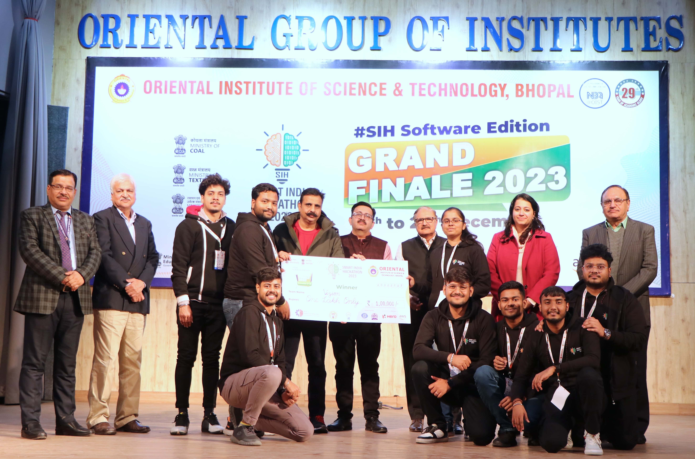
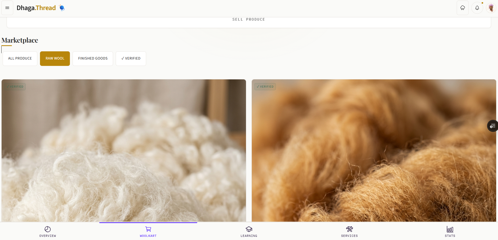
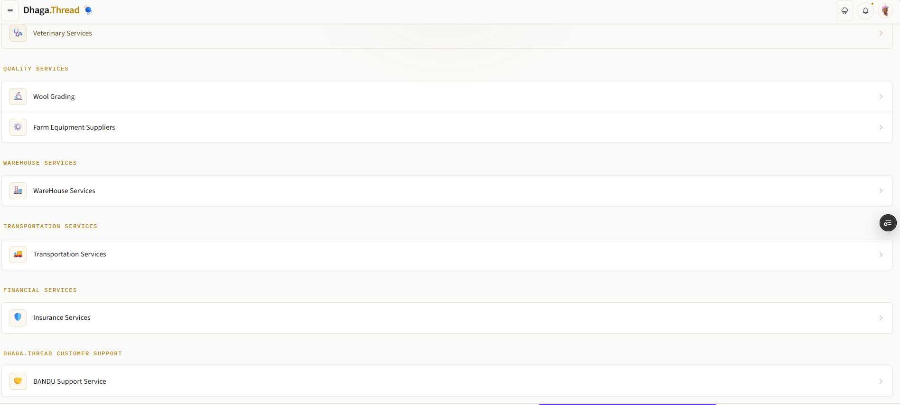

<p align="center">
  <!-- Replace with your logo -->
  
</p>

<h1 align="center">Dhaga.Thread</h1>

<p align="center">
  <b>From Pasture to Product — India's First End-to-End Wool Intelligence Platform</b>
</p>

<p align="center">
  
  
  
  
</p>

<p align="center">
  <!-- Replace with a real project banner/screenshot -->
  
</p>

---

## 🏆 Award

> **Winner — Smart India Hackathon 2023 (SIH 2023)**  
> Built by **Team Vizion** in response to the Ministry of Textiles problem statement on digitising India's unorganised wool sector.

---

## 📖 The Problem

India's wool industry is the **last unorganised frontier** in the textile sector.

- Shepherds sell at rock-bottom prices due to **zero market visibility**
- No single platform connects farmers, processors, buyers, and logistics
- Outdated pre- and post-loom processing with **no digital quality assurance**
- No centralised resource for education or market trends
- Most shepherds rear sheep **not by choice, but by lack of alternatives**

**Dhaga.Thread** exists to change that.

---

## 💡 What is Dhaga.Thread?

**Dhaga.Thread** is a **role-based, multilingual, all-in-one wool management platform** that digitises the entire journey of wool — from the sheep on a hillside farm to the finished fabric on a store shelf.

It serves every stakeholder in the wool value chain under a single roof:

| Role | What they get |
|---|---|
| 🐑 **Farmer / Shepherd** | Wool tracking, reverse bidding, warehouse & transport access |
| 🏭 **Service Providers** | Shearing, sorting, dyeing job listings and service discovery |
| 📦 **Buyers & Sellers** | Live marketplace, negotiation tools, bulk purchase flows |
| 🎓 **Educators** | Upload and host live/recorded training sessions for farmers |
| ✅ **Quality Inspectors** | Digital grading and certified quality assurance reports |
| 🚛 **Transport & Warehouse** | Logistics listings, inventory management dashboard |

---

## 🛠️ System Architecture

**Dhaga.Thread** is built on a robust Model-View-Controller (MVC) architecture, designed for lightweight mobile performance and seamless integration with cloud infrastructure.

```mermaid
graph TD
    %% Styling
    classDef client fill:#FAFAF8,stroke:#C5A880,stroke-width:2px,color:#2B2B2A;
    classDef server fill:#FAFAF8,stroke:#4E5D4C,stroke-width:2px,color:#2B2B2A;
    classDef db fill:#FAFAF8,stroke:#9C3D37,stroke-width:2px,color:#2B2B2A;

    subgraph Client ["Client Interface (Mobile-First EJS)"]
        A["Mobile Viewport (Bootstrap 5 + Splide.js)"]:::client
        B["Ivory & Gold Serif Design System (serif.css)"]:::client
        C["Dynamic Elements (Interactive Roadmap Stepper, Filters)"]:::client
    end

    subgraph Server ["Express.js App Engine (Node.js)"]
        D["Router Controller (routes/index.js)"]:::server
        E["Dynamic Page Renderer (EJS View Engine)"]:::server
        F["Supabase Client Wrapper (src/db/supabase.js)"]:::server
        G["Mock Auth Middleware (Local Demo Mode Fallback)"]:::server
    end

    subgraph Cloud ["Supabase Backend-as-a-Service"]
        H["Go/SQL Auth Services"]:::db
        I["PostgreSQL Database (tables: profiles, meetings)"]:::db
    end

    %% Interactions
    A -->|1. Route Navigation| D
    D -->|2. Check Env / Init| F
    F -->|3a. Credentials Found (Prod)| Cloud
    F -->|3b. Credentials Missing (Local)| G
    G -->|4a. Set Mock Session Cookies| A
    Cloud -->|4b. Return JWT Session & User Metadata| F
    F -->|5. Pass DB context| E
    E -->|6. Render Styled HTML + Ivory Loader| A
```

---

## ✨ Key Features

### 🗺️ Real-Time Wool Tracking
Follow your wool from farm to factory gate. Every handoff, warehouse stop, and transport leg is logged and visible to all authorised parties.

### 📈 Live Market Intelligence
Real-time wool prices, trend charts, and industry news so farmers can time their sales for **maximum profit** — not convenience of middlemen.

### 🔄 Reverse Bidding Marketplace
Farmers list their wool; buyers compete. Power finally shifts to the producer.

### 🎓 Education & Training Hub
Live and recorded sessions by certified educators. State-wise and region-wise producer directory. Skill-building resources tailored for the ground-level farmer.

### ✅ Quality Assurance & Certification
Digital grading workflow for quality inspectors. Certified QA reports are issued on-platform, giving buyers confidence and farmers a premium price lever.

### 🏪 Online Wool Marketplace
Direct farmer-to-buyer transactions with escrow-protected payments — no middlemen taking a cut.

### 📦 Warehouse & Logistics Integration
Book storage, manage inventory, and arrange transport — all from the same app.

### 🌐 Native Multilingual Support
Built for Bharat, not just metros. Supports 8+ Indian languages so every shepherd, wherever they are, can use the platform in their own tongue.

---

## 💼 Business Model

**Dhaga.Thread** is built for long-term sustainability:

1. **Escrow-based payment system** — a small fee on every transaction ensures trust between farmers and buyers while generating platform revenue.
2. **Quality Assurance Certification fee** — inspectors charge for grading; **Dhaga.Thread** takes a platform cut, creating a recurring revenue stream.

---

## 🛠️ Tech Stack

| Layer | Technology |
|---|---|
| **Frontend** | EJS, CSS3, SASS, Bootstrap |
| **Backend** | Node.js, Express.js |
| **Database** | Supabase (PostgreSQL) / MongoDB (Fallback) |
| **Deployment** | Vercel / Render / Heroku |

---

## ⚡ Supabase Authentication & Database Integration

To activate the cloud database and auth integration, create a `.env` file in the root directory:

```env
SUPABASE_URL=https://your-project-id.supabase.co
SUPABASE_KEY=your-supabase-anon-key
```

### Supabase PostgreSQL Tables Schema

#### `profiles` Table (User profiles and roles)
```sql
create table public.profiles (
  id uuid references auth.users on delete cascade not null primary key,
  name text not null,
  role text not null default 'farmer',
  progress int not null default 0,
  created_at timestamp with time zone default timezone('utc'::text, now()) not null
);

-- Enable Row Level Security
alter table public.profiles enable row level security;

-- Policies for Profiles
create policy "Public profiles are viewable by everyone." on public.profiles
  for select using (true);

create policy "Users can update their own profile." on public.profiles
  for update using (auth.uid() = id);
```

#### `meetings` Table (Expert Consultations and Schedules)
```sql
create table public.meetings (
  id uuid default gen_random_uuid() primary key,
  user_id uuid references auth.users(id) on delete cascade not null,
  expert_name text not null,
  topic text not null,
  scheduled_time timestamp with time zone not null,
  meet_link text,
  created_at timestamp with time zone default timezone('utc'::text, now()) not null
);

alter table public.meetings enable row level security;

create policy "Users can view and manage their own meetings." on public.meetings
  for all using (auth.uid() = user_id);
```

---

## 🚀 Getting Started

### Prerequisites
- Node.js v18+
- Supabase account (or local demo mode runs by default)

### Installation

```bash
# 1. Clone the repository
git clone https://github.com/praveshjainnn/Dhaga-.-Thread.git
cd Dhaga-.-Thread

# 2. Install dependencies
npm install

# 3. Set up environment variables (optional for Supabase cloud activation)
cp .env.example .env

# 4. Start the development server
npm start
```

The app will be running at `http://localhost:4000`

---

## 🔑 Demo Logins

Try the live platform without registering:

| Role | Email | Password |
|---|---|---|
| 🐑 Farmer | `farmer@admin.com` | `1234@` |
| 🎓 Teacher | `teacher@admin.com` | `1234@` |
| 🚛 Transport | `transport@admin.com` | `1234@` |

> 📱 **Best viewed on mobile.** Enable Chrome DevTools mobile view for the full premium experience.

---

## 🌐 Live Links

| Resource | Link |
|---|---|
| 🌍 Live App | [knitkraft.onrender.com](https://knitkraft.onrender.com/) |
| 📊 Pitch Deck | [View on Canva](https://www.canva.com/design/DAGP_9EsdGI/WQJE7HY9nDG7qmt9gBuDuA/edit) |

---

## 📸 Screenshots

| Home | Marketplace | Tracking |
|---|---|---|
|  |  |  |

---

## 🗂️ Project Structure

```
dhaga-thread/
├── views/           # EJS templates
├── public/          # Static assets (CSS, JS, images)
├── routes/          # Express route handlers
├── models/          # Data models
├── src/             # Source logic (DB connectors)
└── app.js           # Entry point
```

---

## 🤝 Contributing

Pull requests are welcome! For major changes, please open an issue first to discuss what you'd like to change.

1. Fork the repo
2. Create a feature branch (`git checkout -b feature/AmazingFeature`)
3. Commit your changes (`git commit -m 'Add AmazingFeature'`)
4. Push to the branch (`git push origin feature/AmazingFeature`)
5. Open a Pull Request

---

## 👥 Team Vizion

Built with ❤️ for India's 🐑 shepherds and the wool industry.

---

## 📄 License

Distributed under the MIT License. See `LICENSE` for more information.

---

<p align="center">
  <i>"Most shepherds in India rear sheep not by choice, but due to lack of alternatives.<br/>
  Dhaga.Thread is built to change that — one thread at a time."</i>
</p>

<p align="center">— Team Vizion, SIH 2023 Champions 🏆</p>
