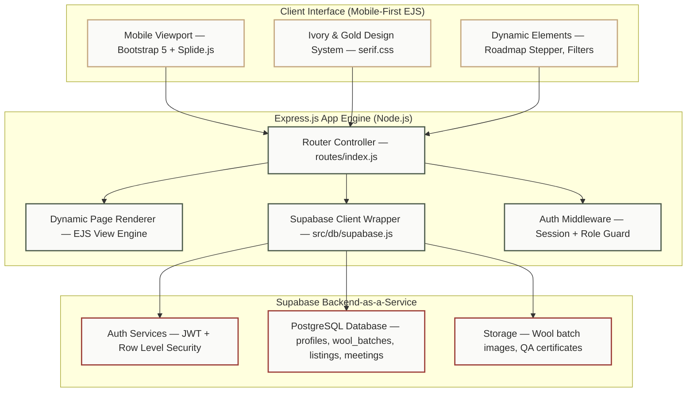

# <p align="center"><br>Dhaga.Thread</p>

<h2 align="center">A Premium Digital Ecosystem for India's Wool Shepherds, Artisans & Buyers</h2>

<p align="center">
  
  
  
  
  
  
</p>

<hr/>

<p align="center">
  <b>Dhaga.Thread</b> is a comprehensive, role-based mobile-web platform designed to digitize, streamline, and empower India's fragmented wool supply chain — from sheep shearing and sorting to quality testing, escrow-backed trading, and final fabric creation.<br/><br/>
  Built for <b>India's 3+ million shepherds and artisans</b> who have no unified digital infrastructure, Dhaga.Thread brings transparency, fair pricing, and financial dignity to an industry that has remained largely unorganized since independence.
</p>

---

## 🌿 The Problem We're Solving

India is the **4th largest wool producer** in the world — yet most shepherds sell wool at exploitative rates to middlemen, have no access to real market prices, no quality certification, no logistics support, and no training in modern wool practices.

**The result:** Poverty cycles for 3M+ pastoral families. A dying craft. A broken industry.

**Dhaga.Thread** is the missing digital layer.

---

## ✨ What Makes Dhaga.Thread Different

| Feature | What it does |
|---|---|
| 🧑‍🌾 **Role-Based Dashboards** | Customized interfaces for Shepherds, Buyers, Weavers, Vets, Logistics, Quality Inspectors, and Educators |
| 💰 **Escrow Payments** | Secure, transparent transactions — funds held until delivery confirmed |
| 📍 **Wool Tracking** | Real-time supply chain visibility from shearing to retail |
| 🏅 **Quality Certification** | Digital QA grading and certification for wool batches |
| 📊 **Live Market Prices** | Real-time wool price feeds and trend analytics |
| 🎓 **Education Hub** | Live + recorded training sessions for shepherds in their language |
| 🌐 **8+ Indian Languages** | Native multilingual support including Hindi, Urdu, Kashmiri, Gujarati |
| 📦 **Warehouse & Logistics** | Inventory management and transport partner integration |
| 🔄 **Reverse Bidding** | Buyers bid for shepherd wool — farmers get best price |

---

## 🛠️ System Architecture

Dhaga.Thread is built on a clean **MVC architecture** optimized for lightweight mobile performance and cloud-native scalability.



---

## 🗂️ Project Structure

```
dhaga-thread/
├── app.js                  # Express entry point
├── bin/www                 # HTTP server bootstrap
├── routes/
│   └── index.js            # All route handlers
├── views/                  # EJS templates
│   ├── Pages/              # Core pages (dashboard, marketplace, tracking)
│   └── partials/           # Navbar, footer, components
├── public/
│   ├── css/                # Global + role-specific stylesheets
│   ├── js/                 # Client-side scripts
│   └── images/             # Static assets
├── models/                 # Data models
├── src/
│   └── db/
│       └── supabase.js     # Supabase client initialization
├── lang/                   # i18n language JSON files (8+ languages)
├── screenshots/            # App screenshots for documentation
├── package.json
└── .env.example            # Environment variable template
```

---

## 🚀 Getting Started

### Prerequisites

- Node.js v18+
- npm v9+
- A free [Supabase](https://supabase.com) account

### Installation

```bash
# 1. Clone the repository
git clone https://github.com/YOUR_USERNAME/dhaga-thread.git
cd dhaga-thread

# 2. Install dependencies
npm install

# 3. Set up environment variables
cp .env.example .env
# Fill in your Supabase URL and anon key (see below)

# 4. Start the development server
npm start
```

Open [http://localhost:3000](http://localhost:3000) in your browser.

### Environment Variables

Create a `.env` file in the root directory:

```env
PORT=3000
SUPABASE_URL=your_supabase_project_url
SUPABASE_ANON_KEY=your_supabase_anon_key
SESSION_SECRET=any_long_random_string
```

Get your Supabase credentials from: **Project Settings → API** in your Supabase dashboard.

### Demo Logins (Local Development)

| Role | Email | Password |
|---|---|---|
| 🧑‍🌾 Shepherd/Farmer | `shepherd@demo.com` | `demo1234` |
| 🛍️ Buyer | `buyer@demo.com` | `demo1234` |
| 🚛 Transport Partner | `transport@demo.com` | `demo1234` |
| 🎓 Educator | `educator@demo.com` | `demo1234` |

---

## 📱 App Roles & Interfaces

### 🧑‍🌾 Shepherd Dashboard
Track your flock, list wool batches, access vet services, view live market prices, and receive payments securely via escrow.

### 🛍️ Buyer / Retailer Dashboard
Browse certified wool listings, place bids, track shipments, and download quality certificates.

### 🏅 Quality Inspector
Grade wool batches digitally, issue QA certifications, and flag disputes.

### 🚛 Logistics Partner
Manage transport bookings, track deliveries, and coordinate warehouse handoffs.

### 🎓 Educator
Host live/recorded training sessions for shepherds; distribute regional content in local languages.

### 🏦 Warehouse Manager
Manage inventory across storage locations, handle check-in/check-out, and generate stock reports.

---

## 🌐 Multilingual Support

Dhaga.Thread is built for India — which means it speaks India's languages.

Currently supported: **Hindi · Urdu · Kashmiri · Gujarati · Rajasthani · Punjabi · English · Marathi**

Language files live in `/lang/*.json` — contributions for new languages are welcome.

---

## 🧪 Tech Stack

| Layer | Technology |
|---|---|
| Frontend | EJS, Bootstrap 5, SCSS, Splide.js |
| Backend | Node.js, Express.js |
| Database | PostgreSQL via Supabase |
| Auth | Supabase Auth (JWT + RLS) |
| Payments | Escrow model (Razorpay integration — roadmap) |
| Deployment | Render / Railway |
| i18n | Custom JSON language packs |

---

## 🗺️ Roadmap

- [x] Role-based dashboards (Shepherd, Buyer, Educator, Logistics, QA, Warehouse)
- [x] Multilingual support (8 languages)
- [x] Wool batch listing and tracking
- [x] Live market price feed
- [x] Education & training hub
- [ ] Escrow payment gateway (Razorpay)
- [ ] AI-based wool grading assistant
- [ ] Offline-first PWA mode for low-connectivity areas
- [ ] SMS/WhatsApp notifications for shepherds without smartphones
- [ ] Government scheme integration (SWIS, CWDB schemes)
- [ ] Android APK via Capacitor

---

## 🤝 Contributing

We welcome contributions — especially from developers who understand rural India, pastoral communities, or the textile supply chain.

1. Fork the repo
2. Create your feature branch: `git checkout -b feature/your-feature`
3. Commit your changes: `git commit -m 'Add: your feature'`
4. Push to the branch: `git push origin feature/your-feature`
5. Open a Pull Request

Please read our [Contributing Guidelines](CONTRIBUTING.md) before submitting.

---

## 📸 Screenshots

> *(Add screenshots here once UI is finalized)*

| Shepherd Dashboard | Marketplace | Wool Tracking |
|---|---|---|
| `screenshots/shepherd.png` | `screenshots/marketplace.png` | `screenshots/tracking.png` |

---

## 📄 License

This project is licensed under the **MIT License** — see the [LICENSE](LICENSE) file for details.

---

## 💙 Built With Purpose

Dhaga.Thread is built for the 3 million pastoral families of India who have been weaving this nation's textile heritage for centuries — and deserve a platform worthy of their craft.

> *"धागा जोड़ता है। Thread connects."*

---

<p align="center">Made with ❤️ for India's wool artisans</p>
